# GZCLP Hevy Tracker - Technical Architecture Documentation

**Version:** 2.3.0
**Last Updated:** 2026-01-10
**Target Audience:** LLM assistants and developers working on the codebase

---

## Table of Contents

1. [Executive Summary](#1-executive-summary)
2. [System Overview](#2-system-overview)
3. [Architecture Patterns](#3-architecture-patterns)
4. [State Management](#4-state-management)
5. [Component Architecture](#5-component-architecture)
6. [Business Logic](#6-business-logic)
7. [Data Flow](#7-data-flow)
8. [API Integration](#8-api-integration)
9. [Directory Structure](#9-directory-structure)
10. [Type System](#10-type-system)
11. [Key Algorithms](#11-key-algorithms)
12. [Testing Strategy](#12-testing-strategy)
13. [Performance Considerations](#13-performance-considerations)
14. [Development Patterns](#14-development-patterns)
15. [Future Architecture Considerations](#15-future-architecture-considerations)

---

## 1. Executive Summary

### 1.1 What This Application Does

The GZCLP Hevy Tracker is a **frontend-only progressive web application** that implements the GZCLP (GZCL Linear Progression) weightlifting methodology with intelligent Hevy API integration. It automates progression tracking, weight calculations, and routine management that Hevy lacks natively.

**Core Value Proposition:**
- Reads workout data from Hevy API to analyze performance
- Calculates GZCLP progression (weight increases, stage changes, deloads)
- Presents recommendations for user review before applying
- Pushes updated routines back to Hevy for next workout

### 1.2 Key Architectural Decisions

| Decision | Rationale | Impact |
|----------|-----------|--------|
| **Frontend-only SPA** | No backend needed, user owns data | Simple deployment, localStorage-based |
| **Split localStorage** | Performance optimization | Three separate stores: config, progression, history |
| **Role-based exercise system** | Simplifies T1/T2 independence | Main lifts have dual progression (squat-T1, squat-T2) |
| **Pending changes pattern** | User review before applying | Changes stored until explicitly approved |
| **React Context for read-only state** | Avoid prop drilling | Performance via selective subscriptions |
| **Chart.js for visualization** | Lightweight, battle-tested | Progression charts with prediction algorithm |

### 1.3 Tech Stack

```
┌─────────────────────────────────────────────────────┐
│  React 18.3 + TypeScript 5.9 (strict mode)         │
│  Vite 5.4 + Tailwind CSS 4.1                       │
├─────────────────────────────────────────────────────┤
│  State: Custom hooks + React Context               │
│  Storage: localStorage (split into 3 stores)       │
│  Charts: Chart.js 4.x + react-chartjs-2            │
├─────────────────────────────────────────────────────┤
│  External API: Hevy REST API (v1)                  │
│  Auth: API key stored in localStorage              │
└─────────────────────────────────────────────────────┘
```

**Total codebase:** ~9,228 lines of TypeScript/TSX

---

## 2. System Overview

### 2.1 High-Level Architecture


### 2.2 GZCLP Domain Context

**GZCLP** (GZCL Linear Progression) is a weightlifting program with three tiers:
- **T1 (Tier 1):** Main compound lifts (5x3+ → 6x2+ → 10x1+ → deload)
- **T2 (Tier 2):** Secondary compounds (3x10 → 3x8 → 3x6 → deload)
- **T3 (Tier 3):** Accessory exercises (3x15+, progress when AMRAP ≥25 reps)

**Program Structure:**
- 4-day rotation: A1, B1, A2, B2
- Main lifts (Squat, Bench, OHP, Deadlift) alternate T1/T2 roles across days
- Independent progression per role-tier combination (e.g., "squat-T1" vs "squat-T2")

### 2.3 Application Lifecycle


---

## 3. Architecture Patterns

### 3.1 Composition Over Configuration

The application heavily favors **composition patterns**:
- Small, focused components with single responsibilities
- Custom hooks for business logic extraction
- Utility functions for pure calculations
- Context for cross-cutting concerns (toast notifications, program data)

### 3.2 Separation of Concerns

```
┌──────────────────────────────────────┐
│         Presentation Layer           │
│  (React Components - pure UI logic)  │
└──────────────────┬───────────────────┘
                   │
┌──────────────────▼───────────────────┐
│         Application Layer            │
│  (Custom Hooks - orchestration)      │
└──────────────────┬───────────────────┘
                   │
┌──────────────────▼───────────────────┐
│         Domain Layer                 │
│  (Business Logic - GZCLP rules)      │
└──────────────────┬───────────────────┘
                   │
┌──────────────────▼───────────────────┐
│      Infrastructure Layer            │
│  (Storage, API clients, utilities)   │
└──────────────────────────────────────┘
```

**Examples:**
- **Presentation:** `<ExerciseCard>` displays exercise data
- **Application:** `useProgression()` orchestrates workout analysis
- **Domain:** `calculateT1Progression()` implements GZCLP rules
- **Infrastructure:** `HevyClient` handles HTTP requests

### 3.3 Unidirectional Data Flow


No upward data flow - state changes always propagate downward through props/context.

---

## 4. State Management

### 4.1 Split Storage Architecture

**Problem:** Original monolithic `gzclp_state` localStorage key caused performance issues with large history datasets.

**Solution:** Split into three optimized stores:

```typescript
// Storage Keys
const STORAGE_KEYS = {
  CONFIG: 'gzclp_config',        // ~2-10KB (config, exercises, settings)
  PROGRESSION: 'gzclp_progression', // ~5-20KB (current progression, pending changes)
  HISTORY: 'gzclp_history'       // ~50KB-5MB (chart data, grows unbounded)
}
```

#### ConfigState (`gzclp_config`)
**Change frequency:** Low (modified during setup/settings)
```typescript
interface ConfigState {
  version: string
  apiKey: string
  program: ProgramConfig        // routine IDs, current day
  settings: UserSettings        // weight unit, increments, rest timers
  exercises: Record<string, ExerciseConfig>
  t3Schedule: Record<GZCLPDay, string[]>
}
```

#### ProgressionStore (`gzclp_progression`)
**Change frequency:** High (modified after every workout)
```typescript
interface ProgressionStore {
  progression: Record<string, ProgressionState>  // Current weights/stages
  pendingChanges: PendingChange[]
  lastSync: string | null
  totalWorkouts: number
  mostRecentWorkoutDate: string | null
  acknowledgedDiscrepancies: AcknowledgedDiscrepancy[]
  needsPush: boolean
}
```

#### HistoryState (`gzclp_history`)
**Change frequency:** Append-only (grows over time)
```typescript
interface HistoryState {
  progressionHistory: Record<string, ExerciseHistory>  // Chart visualization data
}
```

### 4.2 State Management Hooks

#### Facade + Dependency Injection Pattern

The `useProgram()` hook uses the **Facade + Dependency Injection** pattern:
- **Facade**: Provides a unified API for all state operations
- **DI**: Storage hooks are instantiated once in the facade and passed to domain hooks

```
useProgram (Facade - 196 lines)
    │
    ├── Storage Hooks (instantiated once)
    │       ├── useConfigStorage      - Config localStorage (~2-10KB)
    │       ├── useProgressionStorage - Progression localStorage (~5-20KB)
    │       └── useHistoryStorage     - History localStorage (~50KB-5MB)
    │
    └── Domain Hooks (receive storage via injection)
            ├── useExerciseManagement  (~60 lines)  - Exercise CRUD
            ├── useProgramSettings     (~80 lines)  - Config settings
            ├── useProgressionManager  (~120 lines) - Progression/sync
            ├── useHistoryManager      (~40 lines)  - History operations
            └── useDataPersistence     (~50 lines)  - Import/export/reset
```

#### useProgram (Facade)

```typescript
// src/hooks/useProgram.ts
export function useProgram(): UseProgramResult {
  // Instantiate storage hooks once
  const configStorage = useConfigStorage()
  const progressionStorage = useProgressionStorage()
  const historyStorage = useHistoryStorage()

  // Inject storage into domain hooks
  const { addExercise, updateExercise, removeExercise } =
    useExerciseManagement({ configStorage, progressionStorage })

  const { setApiKey, setWeightUnit, ... } =
    useProgramSettings({ configStorage })

  const { setInitialWeight, updateProgression, ... } =
    useProgressionManager({ progressionStorage })

  const { setProgressionHistory, recordHistoryEntry } =
    useHistoryManager({ historyStorage, exercises: config.exercises })

  const { resetState, importState } =
    useDataPersistence({ configStorage, progressionStorage, historyStorage })

  // Compose full GZCLPState from split storage
  const state = useMemo(() => ({ ... }), [config, store, history])

  return { state, /* ... 25+ methods from domain hooks */ }
}
```

#### Domain-Specific Hooks

| Hook | Responsibility | Key Methods |
|------|----------------|-------------|
| **useExerciseManagement** | Exercise CRUD with cross-domain updates | `addExercise()`, `updateExercise()`, `removeExercise()` |
| **useProgramSettings** | Program config and settings | `setApiKey()`, `setWeightUnit()`, `setHevyRoutineIds()`, `setCurrentDay()`, `setT3Schedule()` |
| **useProgressionManager** | Progression state, sync, discrepancies | `setProgressionByKey()`, `updateProgressionBatch()`, `setLastSync()`, `acknowledgeDiscrepancy()` |
| **useHistoryManager** | Workout history for charts | `setProgressionHistory()`, `recordHistoryEntry()` |
| **useDataPersistence** | State import/export/reset | `importState()`, `resetState()` |

**Benefits of this pattern:**
- **Separation of concerns**: Each hook handles one domain
- **Testability**: Domain hooks can be tested in isolation with mocked storage
- **Maintainability**: 462 lines → 196 lines in facade (57% reduction)
- **Single instantiation**: Storage hooks created once, shared via DI

### 4.3 React Context for Read-Only Access

**ProgramContext** eliminates prop drilling for frequently-accessed data:

```typescript
// src/contexts/ProgramContext.tsx
export interface ProgramContextValue {
  weightUnit: WeightUnit
  exercises: Record<string, ExerciseConfig>
  progression: Record<string, ProgressionState>
  t3Schedule: Record<GZCLPDay, string[]>
  currentDay: GZCLPDay
  increments: { upper: number; lower: number }
}

// Usage in deeply nested components
const { weightUnit, exercises } = useProgramContext()
```

**Important:** Context is **read-only**. State mutations happen via `useProgram()` methods passed down as callbacks.

### 4.4 Progression Key System

**Critical design decision:** Main lifts have **dual progression** (T1 and T2 on different days).

```typescript
// Main lift progression keys
"squat-T1"    // Squat as T1 (Day A1: 5x3+)
"squat-T2"    // Squat as T2 (Day A2: 3x10)
"bench-T1"    // Bench as T1 (Day A2: 5x3+)
"bench-T2"    // Bench as T2 (Day A1: 3x10)

// T3 exercises use exerciseId as key
"uuid-1234"   // Lat pulldown
"uuid-5678"   // Dumbbell row
```

**Implementation:**
```typescript
// src/lib/role-utils.ts
export function getProgressionKey(
  exerciseId: string,
  role: ExerciseRole | undefined,
  tier: Tier
): string {
  if (isMainLiftRole(role) && (tier === 'T1' || tier === 'T2')) {
    return `${role}-${tier}`  // "squat-T1"
  }
  return exerciseId  // T3 exercises
}
```

---

## 5. Component Architecture

### 5.1 Component Hierarchy

```
App.tsx (Root)
├── ErrorBoundary
│   └── ToastProvider (Context)
│       └── AppContent
│           ├── SetupWizard (Lazy)
│           │   ├── WelcomeStep
│           │   ├── RoutineAssignmentStep
│           │   ├── ImportReviewStep
│           │   │   ├── DayTabBar
│           │   │   ├── DayReviewPanel
│           │   │   ├── ExerciseAnalysisCard
│           │   │   └── MainLiftVerification
│           │   ├── WeightSetupStep
│           │   └── SetupComplete
│           ├── Dashboard (Lazy)
│           │   ├── DashboardHeader
│           │   │   ├── SyncButton
│           │   │   └── SyncStatus
│           │   ├── DashboardAlerts
│           │   │   ├── UpdateStatus
│           │   │   └── DiscrepancyAlert
│           │   ├── DashboardContent
│           │   │   ├── QuickStats
│           │   │   ├── CurrentWorkout
│           │   │   ├── TierSection (T1/T2/T3)
│           │   │   │   ├── MainLiftCard
│           │   │   │   ├── ExerciseCard
│           │   │   │   └── PendingBadge
│           │   │   ├── T3Overview
│           │   │   └── ProgressionChart
│           │   │       ├── ExerciseSelector
│           │   │       ├── GranularityToggle
│           │   │       ├── ProgressionChart
│           │   │       └── ChartLegend
│           │   ├── ReviewModal
│           │   │   ├── PendingChangeCard
│           │   │   └── WeightEditor
│           │   ├── TodaysWorkoutModal
│           │   ├── PushConfirmDialog
│           │   └── PostWorkoutSummary
│           └── Settings (Lazy)
│               ├── ExerciseManager
│               ├── ImportButton
│               ├── ExportButton
│               └── DeleteDataButton
└── OfflineIndicator
```

### 5.2 Component Design Patterns

#### Pattern 1: Presentation vs Container Components

**Presentation Components** (pure, no hooks):
```tsx
// src/components/Dashboard/PendingBadge.tsx
interface PendingBadgeProps {
  count: number
  type: ChangeType
}

export function PendingBadge({ count, type }: PendingBadgeProps) {
  // Pure rendering logic only
  return <span className={...}>{count}</span>
}
```

**Container Components** (hooks, state, orchestration):
```tsx
// src/components/Dashboard/index.tsx
export function Dashboard() {
  const { state, updateProgressionBatch } = useProgram()
  const { isSyncing, handleSync } = useSyncFlow(...)

  // Orchestration logic
  return <DashboardContent state={state} />
}
```

#### Pattern 2: Lazy Loading for Code Splitting

```tsx
// src/App.tsx
const Dashboard = lazy(() =>
  import('@/components/Dashboard').then((m) => ({ default: m.Dashboard }))
)

function AppContent() {
  return (
    <Suspense fallback={<PageSkeleton />}>
      {isSetupRequired ? <SetupWizard /> : <Dashboard />}
    </Suspense>
  )
}
```

**Impact:** Initial bundle only loads setup wizard OR dashboard, not both.

#### Pattern 3: Compound Components

```tsx
// src/components/common/CollapsibleSection.tsx
export function CollapsibleSection({ title, children, defaultOpen = true }) {
  const [isOpen, setIsOpen] = useState(defaultOpen)

  return (
    <div>
      <button onClick={() => setIsOpen(!isOpen)}>{title}</button>
      {isOpen && <div>{children}</div>}
    </div>
  )
}

// Usage
<CollapsibleSection title="T1 Lifts">
  <MainLiftCard ... />
  <MainLiftCard ... />
</CollapsibleSection>
```

### 5.3 Key Component Responsibilities

#### Dashboard
**File:** `src/components/Dashboard/index.tsx`
**Responsibility:** Main application view orchestration
**Key features:**
- Auto-sync on mount via `useSyncFlow()`
- Pending changes management via `usePendingChanges()`
- Push confirmation dialog via `usePushDialog()`
- Discrepancy resolution with acknowledgment tracking
- Today's workout modal (show current day exercises)

#### SetupWizard
**File:** `src/components/SetupWizard/index.tsx`
**Responsibility:** Initial program configuration
**Flow:**
1. Welcome → Choose import vs create
2. Routine assignment (import) or creation
3. Exercise analysis and weight detection
4. Weight verification (manual overrides)
5. Complete setup → Navigate to dashboard

#### ProgressionChart
**File:** `src/components/ProgressionChart/index.tsx`
**Responsibility:** Historical progression visualization
**Features:**
- Exercise selection dropdown
- Workout vs week granularity toggle
- Prediction algorithm (next 8 workouts)
- Historical data with stage color coding
- Event markers (PR, deload, stage change)

---

## 6. Business Logic

### 6.1 Core Progression Algorithms

#### T1 Progression (Main Lifts)

**File:** `src/lib/progression.ts`

```typescript
function calculateT1Progression(
  current: ProgressionState,
  reps: number[],
  muscleGroup: MuscleGroupCategory,
  unit: WeightUnit
): ProgressionResult
```

**Logic flow:**
```
Check if workout successful:
  ✅ All required sets hit target reps?
    → Add increment, keep stage, track AMRAP

  ❌ Failed?
    → Current stage < 2?
      → Move to next stage (5x3+ → 6x2+ → 10x1+)
    → Stage 2 (final stage)?
      → Deload to 85%, reset to stage 0
```

**Stage requirements:**
```typescript
const T1_REQUIRED_SETS = {
  0: 5,  // 5x3+ requires 5 sets
  1: 6,  // 6x2+ requires 6 sets
  2: 10  // 10x1+ requires 10 sets
}

const T1_SUCCESS_REPS = {
  0: 3,  // Stage 0: at least 3 reps per set
  1: 2,  // Stage 1: at least 2 reps per set
  2: 1   // Stage 2: at least 1 rep per set
}
```

#### T2 Progression (Secondary Lifts)

**File:** `src/lib/progression.ts`

```typescript
function calculateT2Progression(
  current: ProgressionState,
  reps: number[],
  muscleGroup: MuscleGroupCategory,
  unit: WeightUnit
): ProgressionResult
```

**Logic:**
```
Stages: 3x10 → 3x8 → 3x6 → deload
Success: All 3 sets hit target reps
Failure: Move to next stage or deload
```

#### T3 Progression (Accessories)

**File:** `src/lib/progression.ts`

```typescript
function calculateT3Progression(
  current: ProgressionState,
  reps: number[],
  muscleGroup: MuscleGroupCategory,
  unit: WeightUnit
): ProgressionResult
```

**Logic:**
```
Success: AMRAP set (last set) >= 25 reps
  → Add increment
Failure: AMRAP set < 25 reps
  → Repeat same weight (no deload for T3)
```

### 6.2 Workout Analysis

**File:** `src/lib/workout-analysis.ts`

```typescript
export function analyzeWorkout(
  workout: Workout,
  exercises: Record<string, ExerciseConfig>,
  progression: Record<string, ProgressionState>,
  unit: WeightUnit
): WorkoutAnalysisResult[]
```

**Process:**
1. Match workout exercises to tracked exercises (by `exercise_template_id`)
2. Extract rep arrays from sets (filter out warmup sets)
3. Detect weight discrepancies (logged weight ≠ stored progression weight)
4. Return analysis per exercise with success/failure determination

**Warmup detection:**
```typescript
// Skip warmup sets (weight < 85% of working weight)
const isWarmup = set.weight_kg < progressionWeight * 0.85
```

### 6.3 Routine Management

#### Routine Builder

**File:** `src/lib/routine-builder.ts`

Builds Hevy routine payloads from current progression state:

```typescript
export function buildRoutine(
  day: GZCLPDay,
  exercises: ExerciseConfig[],
  progression: Record<string, ProgressionState>,
  settings: UserSettings,
  t3Schedule: Record<GZCLPDay, string[]>
): CreateRoutineRequest
```

**Structure:**
```json
{
  "routine": {
    "title": "GZCLP Day A1 🏋️",
    "exercises": [
      {
        "exercise_template_id": "...",
        "rest_seconds": 240,
        "notes": "T1 - 5x3+",
        "sets": [
          { "type": "warmup", "weight_kg": 20, "reps": 10 },
          { "type": "warmup", "weight_kg": 50, "reps": 5 },
          { "type": "normal", "weight_kg": 100, "reps": 3 },
          // ... working sets
        ]
      }
    ]
  }
}
```

**Warmup generation:**
```typescript
// Light lifts (≤40kg): bar, 50%, 75%
// Heavy lifts (>40kg): 50%, 70%, 85%
const warmupSets = generateWarmupSets(workingWeight, unit)
```

#### Routine Notes

**File:** `src/lib/routine-notes.ts`

Generates human-readable routine notes with progression summary:
```
🏋️ GZCLP Day A1

T1 Squat: 100kg (5x3+, Stage 1)
T2 Bench Press: 60kg (3x10)
T3 Lat Pulldown: 45kg (3x15+)

Week 8, Workout #23
Last updated: 2024-01-15
```

### 6.4 Import Analysis

**File:** `src/lib/import-analysis.ts`

Analyzes workout history during setup wizard import:

```typescript
export function analyzeExerciseHistory(
  exerciseId: string,
  workouts: Workout[]
): ImportAnalysis
```

**Detects:**
- Most recent working weight
- Current stage (by matching set/rep patterns)
- Last workout date
- Progression trend (gaining, maintaining, deloading)
- Confidence level (high if pattern matches, manual if ambiguous)

**Stage detection patterns:**
```typescript
const T1_STAGE_PATTERNS = [
  [5, 3, 0],  // 5 sets of 3 reps = Stage 0
  [6, 2, 1],  // 6 sets of 2 reps = Stage 1
  [10, 1, 2]  // 10 sets of 1 rep = Stage 2
]
```

---

## 7. Data Flow

### 7.1 Sync Flow (Pull from Hevy)


### 7.2 Review and Apply Flow


### 7.3 Push Flow (Update Hevy Routines)

```mermaid
sequenceDiagram
    participant User
    participant PushDialog
    participant usePushDialog
    participant PushPreview
    participant RoutineBuilder
    participant HevyClient
    participant localStorage

    User->>PushDialog: Click "Update Hevy"
    PushDialog->>usePushDialog: handleOpenPushDialog()

    usePushDialog->>PushPreview: generatePreview()
    PushPreview->>RoutineBuilder: buildRoutine() (×4 days)
    RoutineBuilder-->>PushPreview: Routine payloads
    PushPreview-->>usePushDialog: Preview with actions

    usePushDialog-->>PushDialog: Show preview
    User->>PushDialog: Review, modify actions
    User->>PushDialog: Click "Confirm"

    PushDialog->>usePushDialog: handleConfirmPush()

    loop For each day
        usePushDialog->>HevyClient: updateRoutine(routineId, payload)
        HevyClient-->>usePushDialog: Success
    end

    usePushDialog->>useProgram: setNeedsPush(false)
    usePushDialog->>localStorage: Save
    usePushDialog-->>PushDialog: Success message
```



### 7.4 State Persistence Flow

Every state mutation follows this pattern:

```typescript
// 1. Hook receives state update request
const updateProgression = useCallback((exerciseId, updates) => {
  // 2. Compute new state
  const newProgression = {
    ...progressionStore.progression,
    [exerciseId]: { ...existing, ...updates }
  }

  // 3. Update React state (triggers re-render)
  setProgression(newProgression)

  // 4. Save to localStorage (inside setProgression)
  localStorage.setItem('gzclp_progression', JSON.stringify(newStore))
}, [progressionStore])
```

**Critical invariant:** localStorage is **always in sync** with React state.

---

## 8. API Integration

### 8.1 Hevy Client Architecture

**File:** `src/lib/hevy-client.ts`

```typescript
export class HevyClient {
  private readonly apiKey: string
  private readonly baseUrl = 'https://api.hevyapp.com/v1'
  private readonly timeout = 30000  // 30s

  async getWorkouts(params: PaginatedRequest): Promise<WorkoutsResponse>
  async getRoutines(params: PaginatedRequest): Promise<RoutinesResponse>
  async updateRoutine(routineId: string, request: UpdateRoutineRequest): Promise<Routine>
  // ... more methods
}
```

**Error handling:**
```typescript
class HevyAuthError extends HevyApiClientError {
  constructor() {
    super('Invalid API key', 401)
  }
}

class HevyRateLimitError extends HevyApiClientError {
  constructor(public retryAfter: number | null) {
    super('Rate limit exceeded', 429)
  }
}
```

### 8.2 API Endpoints Used

| Endpoint | Method | Purpose | Pagination |
|----------|--------|---------|------------|
| `/v1/workouts` | GET | Fetch workout history | 10/page |
| `/v1/workouts/{id}` | GET | Fetch single workout | N/A |
| `/v1/workouts/count` | GET | Get total workout count | N/A |
| `/v1/routines` | GET | List user routines | 10/page |
| `/v1/routines/{id}` | GET | Fetch single routine | N/A |
| `/v1/routines` | POST | Create new routine | N/A |
| `/v1/routines/{id}` | PUT | Update routine | N/A |
| `/v1/exercise_templates` | GET | List exercises | 100/page |

**Authentication:**
```
Header: api-key: {user_api_key}
Content-Type: application/json
```

### 8.3 API Integration Hooks

#### useHevyApi

**File:** `src/hooks/useHevyApi.ts`

Thin wrapper around HevyClient with React integration:

```typescript
export function useHevyApi(apiKey: string | null) {
  const client = useMemo(
    () => apiKey ? createHevyClient(apiKey) : null,
    [apiKey]
  )

  // Memoized methods to prevent re-renders
  const fetchWorkouts = useCallback(async () => {
    if (!client) throw new Error('No API key')
    return client.getAllWorkouts()
  }, [client])

  return { client, fetchWorkouts, /* ... */ }
}
```

#### useProgression

**File:** `src/hooks/useProgression.ts`

High-level sync orchestration:

```typescript
export function useProgression(options: UseProgressionOptions) {
  const [isSyncing, setIsSyncing] = useState(false)
  const [pendingChanges, setPendingChanges] = useState<PendingChange[]>([])
  const [discrepancies, setDiscrepancies] = useState<DiscrepancyInfo[]>([])

  const syncWorkouts = useCallback(async () => {
    setIsSyncing(true)
    try {
      const workouts = await hevyClient.getWorkouts()
      const analysisResults = analyzeWorkouts(workouts, ...)
      const changes = createPendingChangesFromAnalysis(analysisResults, ...)
      const discrepancies = detectDiscrepancies(analysisResults, ...)

      setPendingChanges(changes)
      setDiscrepancies(discrepancies)
    } catch (error) {
      setSyncError(error.message)
    } finally {
      setIsSyncing(false)
    }
  }, [hevyClient, exercises, progression])

  return { isSyncing, pendingChanges, discrepancies, syncWorkouts }
}
```

### 8.4 Offline Handling

**File:** `src/hooks/useOnlineStatus.ts`

```typescript
export function useOnlineStatus() {
  const [isOnline, setIsOnline] = useState(navigator.onLine)
  const [isHevyReachable, setIsHevyReachable] = useState(true)

  // Browser online/offline events
  useEffect(() => {
    const handleOnline = () => setIsOnline(true)
    const handleOffline = () => setIsOnline(false)

    window.addEventListener('online', handleOnline)
    window.addEventListener('offline', handleOffline)

    return () => {
      window.removeEventListener('online', handleOnline)
      window.removeEventListener('offline', handleOffline)
    }
  }, [])

  // Check Hevy API reachability
  const checkHevyConnection = useCallback(async () => {
    try {
      await fetch('https://api.hevyapp.com/v1/health', { method: 'HEAD' })
      setIsHevyReachable(true)
    } catch {
      setIsHevyReachable(false)
    }
  }, [])

  return { isOnline, isHevyReachable, checkHevyConnection }
}
```

**UI Impact:**
- Show offline indicator banner
- Disable sync/push buttons when offline
- Allow viewing cached data
- Queue changes for later (via pendingChanges system)

---

## 9. Directory Structure

```
gzclp-hevy-tracker/
├── docs/                           # Documentation
│   ├── ARCHITECTURE.md            # This file
│   ├── SPEC.md                    # Original technical spec
│   ├── GZCLP-Progression-Spec.md  # GZCLP methodology reference
│   └── features/                  # User-facing feature guides
│
├── src/
│   ├── main.tsx                   # Application entry point
│   ├── App.tsx                    # Root component (routing, lazy loading)
│   ├── index.css                  # Global styles (Tailwind directives)
│   │
│   ├── components/                # React components (organized by feature)
│   │   ├── Dashboard/            # Main application view
│   │   │   ├── index.tsx         # Dashboard orchestration component
│   │   │   ├── DashboardHeader.tsx
│   │   │   ├── DashboardAlerts.tsx
│   │   │   ├── DashboardContent.tsx
│   │   │   ├── CurrentWorkout.tsx
│   │   │   ├── QuickStats.tsx
│   │   │   ├── TierSection.tsx
│   │   │   ├── MainLiftCard.tsx  # T1/T2 main lift display
│   │   │   ├── ExerciseCard.tsx  # Generic exercise card
│   │   │   ├── T3Overview.tsx
│   │   │   ├── SyncButton.tsx
│   │   │   ├── SyncStatus.tsx
│   │   │   ├── DiscrepancyAlert.tsx
│   │   │   ├── PendingBadge.tsx
│   │   │   ├── PushConfirmDialog.tsx
│   │   │   ├── TodaysWorkoutModal.tsx
│   │   │   └── UpdateStatus.tsx
│   │   │
│   │   ├── SetupWizard/          # Initial setup flow
│   │   │   ├── index.tsx         # Wizard orchestration
│   │   │   ├── WelcomeStep.tsx
│   │   │   ├── RoutineAssignmentStep.tsx
│   │   │   ├── ImportReviewStep.tsx
│   │   │   ├── WeightSetupStep.tsx
│   │   │   ├── SetupComplete.tsx
│   │   │   ├── DayTabBar.tsx
│   │   │   ├── DayReviewPanel.tsx
│   │   │   ├── ExerciseAnalysisCard.tsx
│   │   │   ├── MainLiftVerification.tsx
│   │   │   ├── ExerciseSelector.tsx
│   │   │   ├── SlotAssignment.tsx
│   │   │   ├── WeightInput.tsx
│   │   │   ├── UnitSelector.tsx
│   │   │   └── NextWorkoutStep.tsx
│   │   │
│   │   ├── ProgressionChart/     # Chart visualization
│   │   │   ├── index.tsx
│   │   │   ├── ProgressionChart.tsx
│   │   │   ├── ExerciseSelector.tsx
│   │   │   ├── GranularityToggle.tsx
│   │   │   └── ChartLegend.tsx
│   │   │
│   │   ├── ReviewModal/          # Pending changes review
│   │   │   ├── index.tsx
│   │   │   ├── PendingChangeCard.tsx
│   │   │   └── WeightEditor.tsx
│   │   │
│   │   ├── PostWorkoutSummary/   # Post-workout summary panel
│   │   │   └── index.tsx
│   │   │
│   │   ├── Settings/             # Settings panel
│   │   │   ├── index.tsx
│   │   │   ├── ExerciseManager.tsx
│   │   │   ├── ImportButton.tsx
│   │   │   ├── ExportButton.tsx
│   │   │   ├── DeleteDataButton.tsx
│   │   │   └── ImportConfirmDialog.tsx
│   │   │
│   │   ├── common/               # Shared/reusable components
│   │   │   ├── CollapsibleSection.tsx
│   │   │   ├── RoleDropdown.tsx
│   │   │   ├── RoutineSelector.tsx
│   │   │   ├── WeightInput.tsx
│   │   │   ├── ErrorState.tsx
│   │   │   ├── ErrorFallback.tsx
│   │   │   ├── LoadingSkeleton.tsx
│   │   │   ├── PageSkeleton.tsx
│   │   │   ├── ChartSkeleton.tsx
│   │   │   └── OfflineIndicator.tsx
│   │   │
│   │   └── ErrorBoundary.tsx     # Top-level error boundary
│   │
│   ├── contexts/                 # React Context providers
│   │   ├── ProgramContext.tsx    # Read-only program state context
│   │   └── ToastContext.tsx      # Toast notifications
│   │
│   ├── hooks/                    # Custom React hooks
│   │   ├── useProgram.ts         # Facade: Central state orchestrator (196 lines)
│   │   │
│   │   │   # Storage hooks (localStorage access)
│   │   ├── useConfigStorage.ts       # Config localStorage hook
│   │   ├── useProgressionStorage.ts  # Progression localStorage hook
│   │   ├── useHistoryStorage.ts      # History localStorage hook
│   │   ├── useLocalStorage.ts        # Generic localStorage hook
│   │   │
│   │   │   # Domain hooks (injected with storage, used by useProgram)
│   │   ├── useExerciseManagement.ts  # Exercise CRUD operations
│   │   ├── useProgramSettings.ts     # Config settings mutations
│   │   ├── useProgressionManager.ts  # Progression/sync/discrepancy
│   │   ├── useHistoryManager.ts      # History operations
│   │   ├── useDataPersistence.ts     # Import/export/reset
│   │   │
│   │   │   # Feature hooks (used by components)
│   │   ├── useHevyApi.ts         # Hevy API client wrapper
│   │   ├── useProgression.ts     # Workout sync orchestration
│   │   ├── usePendingChanges.ts  # Pending changes management
│   │   ├── useSyncFlow.ts        # Sync flow orchestration
│   │   ├── usePushDialog.ts      # Push dialog orchestration
│   │   ├── useRoutineImport.ts   # Import wizard logic
│   │   ├── useChartData.ts       # Chart data preparation
│   │   └── useOnlineStatus.ts    # Online/offline detection
│   │
│   ├── lib/                      # Business logic (pure functions)
│   │   ├── progression.ts        # GZCLP progression algorithms
│   │   ├── workout-analysis.ts   # Workout analysis logic
│   │   ├── routine-builder.ts    # Hevy routine payload builder
│   │   ├── routine-manager.ts    # Routine CRUD operations
│   │   ├── routine-notes.ts      # Routine notes generator
│   │   ├── routine-importer.ts   # Import from existing routines
│   │   ├── hevy-client.ts        # Hevy API HTTP client
│   │   ├── history-importer.ts   # Historical data import
│   │   ├── history-recorder.ts   # History entry creation
│   │   ├── import-analysis.ts    # Import wizard analysis
│   │   ├── apply-changes.ts      # Apply pending changes
│   │   ├── push-preview.ts       # Push preview generation
│   │   ├── discrepancy-utils.ts  # Discrepancy detection
│   │   ├── role-utils.ts         # Exercise role utilities
│   │   ├── stage-detector.ts     # Stage detection from sets
│   │   ├── weeks-calculator.ts   # Weeks on program calculation
│   │   ├── data-export.ts        # Export state to JSON
│   │   ├── data-import.ts        # Import state from JSON
│   │   ├── state-factory.ts      # State initialization
│   │   └── constants.ts          # GZCLP constants
│   │
│   ├── types/                    # TypeScript type definitions
│   │   ├── state.ts              # Application state types
│   │   ├── storage.ts            # Split storage types
│   │   ├── hevy.ts               # Hevy API types
│   │   └── import.ts             # Import wizard types
│   │
│   ├── utils/                    # Utility functions
│   │   ├── formatting.ts         # Display formatting (weight, date)
│   │   ├── id.ts                 # UUID generation
│   │   ├── validation.ts         # Input validation
│   │   ├── stats.ts              # Statistical calculations
│   │   └── summary.ts            # Summary generation
│   │
│   └── vite-env.d.ts            # Vite environment types
│
├── tests/                        # Test files
│   └── (test files mirror src/ structure)
│
├── package.json                  # Dependencies and scripts
├── tsconfig.json                 # TypeScript configuration
├── vite.config.ts                # Vite build configuration
├── tailwind.config.js            # Tailwind CSS configuration
├── eslint.config.js              # ESLint configuration
└── vitest.config.ts              # Vitest test configuration
```

### Key Organizational Principles

1. **Feature-based component organization:** Components grouped by feature (Dashboard, SetupWizard, etc.) rather than by type
2. **Pure business logic in /lib:** No React dependencies, fully testable
3. **Hooks for orchestration:** Bridge between components and business logic
4. **Types mirror structure:** Type definitions organized to match their usage
5. **Common/shared last:** Reusable components in `/common`, feature-specific components in feature folders

---

## 10. Type System

### 10.1 Core Domain Types

**File:** `src/types/state.ts`

```typescript
// Exercise roles - the "slot" system
export type ExerciseRole = 'squat' | 'bench' | 'ohp' | 'deadlift' | 't3'

// GZCLP tiers
export type Tier = 'T1' | 'T2' | 'T3'

// GZCLP days (4-day rotation)
export type GZCLPDay = 'A1' | 'B1' | 'A2' | 'B2'

// Progression stages (0-2)
export type Stage = 0 | 1 | 2

// Weight units
export type WeightUnit = 'kg' | 'lbs'

// Change types
export type ChangeType = 'progress' | 'stage_change' | 'deload' | 'repeat'

// Progression key (role-tier for main lifts, exerciseId for T3)
export type ProgressionKey = string
```

### 10.2 State Interfaces

```typescript
// Root state (composed from split storage)
export interface GZCLPState {
  version: string
  apiKey: string
  program: ProgramConfig
  exercises: Record<string, ExerciseConfig>
  progression: Record<string, ProgressionState>
  pendingChanges: PendingChange[]
  settings: UserSettings
  lastSync: string | null
  t3Schedule: Record<GZCLPDay, string[]>
  totalWorkouts: number
  mostRecentWorkoutDate: string | null
  progressionHistory: Record<string, ExerciseHistory>
  acknowledgedDiscrepancies: AcknowledgedDiscrepancy[]
  needsPush: boolean
}

// Exercise configuration
export interface ExerciseConfig {
  id: string
  hevyTemplateId: string
  name: string
  role?: ExerciseRole
}

// Current progression state
export interface ProgressionState {
  exerciseId: string
  currentWeight: number
  stage: Stage
  baseWeight: number
  lastWorkoutId: string | null
  lastWorkoutDate: string | null
  amrapRecord: number
}

// Pending change (awaiting user review)
export interface PendingChange {
  id: string
  exerciseId: string
  exerciseName: string
  tier: Tier
  type: ChangeType
  progressionKey: ProgressionKey
  currentWeight: number
  currentStage: Stage
  newWeight: number
  newStage: Stage
  newScheme: string
  reason: string
  workoutId: string
  workoutDate: string
  createdAt: string
  setsCompleted?: number
  setsTarget?: number
  amrapReps?: number
  success?: boolean
  newPR?: boolean
}
```

### 10.3 Hevy API Types

**File:** `src/types/hevy.ts`

```typescript
// Workout response from Hevy API
export interface Workout {
  id: string
  title: string
  description: string | null
  start_time: string  // ISO 8601
  end_time: string    // ISO 8601
  exercises: WorkoutExercise[]
}

export interface WorkoutExercise {
  id: string
  exercise_template_id: string
  title: string
  notes: string | null
  sets: WorkoutSet[]
}

export interface WorkoutSet {
  id: string
  type: 'normal' | 'warmup' | 'dropset' | 'failure'
  weight_kg: number | null
  reps: number
  distance_meters: number | null
  duration_seconds: number | null
  rpe: number | null
}

// Routine payload for creation/update
export interface CreateRoutineRequest {
  routine: {
    title: string
    folder_id?: string | null
    notes?: string
    exercises: RoutineExercise[]
  }
}

export interface RoutineExercise {
  exercise_template_id: string
  superset_id?: number | null
  rest_seconds: number
  notes?: string
  sets: RoutineSet[]
}

export interface RoutineSet {
  type: 'normal' | 'warmup' | 'dropset' | 'failure'
  weight_kg: number | null
  reps: number
}
```

### 10.4 Type Guards and Validation

```typescript
// Type guards for storage validation
export function isConfigState(obj: unknown): obj is ConfigState {
  if (!obj || typeof obj !== 'object') return false
  const state = obj as Partial<ConfigState>
  return (
    typeof state.version === 'string' &&
    typeof state.apiKey === 'string' &&
    typeof state.program === 'object' &&
    typeof state.settings === 'object'
  )
}

// Runtime validation for API responses
export function isWorkout(obj: unknown): obj is Workout {
  if (!obj || typeof obj !== 'object') return false
  const workout = obj as Partial<Workout>
  return (
    typeof workout.id === 'string' &&
    typeof workout.start_time === 'string' &&
    Array.isArray(workout.exercises)
  )
}
```

---

## 11. Key Algorithms

### 11.1 Deload Calculation

**File:** `src/lib/progression.ts`

```typescript
export function calculateDeload(weight: number, unit: WeightUnit): number {
  const deloadedWeight = weight * DELOAD_PERCENTAGE  // 85%
  const rounded = roundWeight(deloadedWeight, unit)

  // REQ-PROG-009: Never go below bar weight (20kg / 44lbs)
  const barWeight = unit === 'kg' ? 20 : 44
  return Math.max(rounded, barWeight)
}

export function roundWeight(weight: number, unit: WeightUnit): number {
  const increment = WEIGHT_ROUNDING[unit]  // kg: 2.5, lbs: 5
  return Math.round(weight / increment) * increment
}
```

**Example:**
```
Failed at 100kg
→ 100 * 0.85 = 85kg
→ Round to 2.5kg = 85kg
→ Max(85kg, 20kg) = 85kg ✓

Failed at 25kg
→ 25 * 0.85 = 21.25kg
→ Round to 2.5kg = 22.5kg
→ Max(22.5kg, 20kg) = 22.5kg ✓

Failed at 22.5kg
→ 22.5 * 0.85 = 19.125kg
→ Round to 2.5kg = 20kg
→ Max(20kg, 20kg) = 20kg ✓ (floor at bar weight)
```

### 11.2 Warmup Set Generation

**File:** `src/lib/constants.ts`

```typescript
export const WARMUP_CONFIG = {
  // Light lifts (≤40kg): bar only, 50%, 75%
  lightPercentages: [0, 0.5, 0.75],
  lightReps: [10, 5, 3],

  // Heavy lifts (>40kg): 50%, 70%, 85%
  heavyPercentages: [0.5, 0.7, 0.85],
  heavyReps: [5, 3, 2],

  heavyThreshold: 40,  // kg
  minWeight: 20        // bar weight
}
```

**Implementation:**
```typescript
function generateWarmupSets(workingWeight: number, unit: WeightUnit): RoutineSet[] {
  const isHeavy = workingWeight > WARMUP_CONFIG.heavyThreshold
  const percentages = isHeavy ? WARMUP_CONFIG.heavyPercentages : WARMUP_CONFIG.lightPercentages
  const reps = isHeavy ? WARMUP_CONFIG.heavyReps : WARMUP_CONFIG.lightReps

  return percentages.map((pct, idx) => ({
    type: 'warmup',
    weight_kg: pct === 0 ? WARMUP_CONFIG.minWeight : roundWeight(workingWeight * pct, unit),
    reps: reps[idx]
  }))
}
```

**Example (Heavy lift - 100kg):**
```
Warmup set 1: 50kg × 5 reps
Warmup set 2: 70kg × 3 reps
Warmup set 3: 85kg × 2 reps
Working sets: 100kg × ...
```

### 11.3 Weeks on Program Calculation

**File:** `src/lib/weeks-calculator.ts`

```typescript
export function calculateWeeksOnProgram(
  programCreatedAt: string,
  totalWorkouts: number,
  workoutsPerWeek: number
): number {
  const programStart = new Date(programCreatedAt)
  const now = new Date()
  const msPerWeek = 7 * 24 * 60 * 60 * 1000

  // Method 1: Time-based (weeks since program started)
  const weeksSinceStart = Math.floor((now.getTime() - programStart.getTime()) / msPerWeek)

  // Method 2: Workout-based (workouts completed / workouts per week)
  const weeksByWorkouts = Math.floor(totalWorkouts / workoutsPerWeek)

  // Return maximum (more conservative for "weeks on program" display)
  return Math.max(weeksSinceStart, weeksByWorkouts)
}
```

### 11.4 Chart Prediction Algorithm

**File:** `src/hooks/useChartData.ts`

```typescript
function predictFutureProgression(
  history: ProgressionHistoryEntry[],
  currentWeight: number,
  currentStage: Stage,
  tier: Tier,
  muscleGroup: MuscleGroupCategory,
  unit: WeightUnit,
  numPredictions: number = 8
): ChartDataPoint[] {
  const predictions: ChartDataPoint[] = []
  let weight = currentWeight
  let stage = currentStage

  // Predict next N workouts assuming success
  for (let i = 1; i <= numPredictions; i++) {
    // Simulate successful workout → weight increase
    weight += getIncrement(muscleGroup, unit)

    predictions.push({
      x: history.length + i,
      y: weight,
      date: '', // Not applicable for predictions
      isHistorical: false,
      stage,
      event: undefined
    })
  }

  return predictions
}
```

**Visualization:**
```
Historical (blue):  ●━━━●━━━●━━━●
Predicted (dashed): ╌╌╌○╌╌╌○╌╌╌○╌╌╌○
                    ^
                    Current weight
```

---

## 12. Testing Strategy

### 12.1 Test Structure

```
tests/
├── lib/                    # Business logic unit tests
│   ├── progression.test.ts
│   ├── workout-analysis.test.ts
│   └── routine-builder.test.ts
├── hooks/                  # Hook integration tests
│   ├── useProgram.test.tsx
│   └── usePendingChanges.test.tsx
└── components/             # Component tests
    ├── Dashboard.test.tsx
    └── ReviewModal.test.tsx
```

### 12.2 Testing Patterns

#### Unit Tests (Business Logic)

```typescript
// tests/lib/progression.test.ts
import { describe, it, expect } from 'vitest'
import { calculateT1Progression, isT1Success } from '@/lib/progression'

describe('T1 Progression', () => {
  it('should progress weight on successful workout', () => {
    const current: ProgressionState = {
      exerciseId: 'squat',
      currentWeight: 100,
      stage: 0,
      baseWeight: 100,
      lastWorkoutId: null,
      lastWorkoutDate: null,
      amrapRecord: 3
    }

    const reps = [3, 3, 3, 3, 5]  // Successful 5x3+
    const result = calculateT1Progression(current, reps, 'lower', 'kg')

    expect(result.type).toBe('progress')
    expect(result.newWeight).toBe(105)  // +5kg for lower body
    expect(result.newStage).toBe(0)     // Stay at stage 0
  })

  it('should advance stage on failure', () => {
    const current: ProgressionState = { /* ... */ stage: 0 }
    const reps = [3, 3, 2, 2, 1]  // Failed: only 2 reps on sets 3-4

    const result = calculateT1Progression(current, reps, 'lower', 'kg')

    expect(result.type).toBe('stage_change')
    expect(result.newStage).toBe(1)  // 5x3+ → 6x2+
  })
})
```

#### Component Tests

```typescript
// tests/components/Dashboard.test.tsx
import { render, screen } from '@testing-library/react'
import { Dashboard } from '@/components/Dashboard'

describe('Dashboard', () => {
  it('should show pending changes badge when changes exist', () => {
    // Mock state with pending changes
    const mockState = createMockState({
      pendingChanges: [
        { id: '1', exerciseName: 'Squat', type: 'progress', /* ... */ }
      ]
    })

    render(<Dashboard state={mockState} />)

    expect(screen.getByText('1')).toBeInTheDocument()
    expect(screen.getByText(/pending change/i)).toBeInTheDocument()
  })
})
```

### 12.3 Test Commands

```bash
npm test              # Run all tests once
npm run test:watch    # Watch mode for development
npm run test:coverage # Generate coverage report
```

---

## 13. Performance Considerations

### 13.1 localStorage Optimization

**Problem:** Single monolithic state caused performance degradation with large history datasets.

**Solution:** Split storage into three keys (see [4.1](#41-split-storage-architecture))

**Impact:**
- Config reads: ~2KB (fast)
- Progression reads: ~5-20KB (fast)
- History reads: Only when opening chart component (lazy)

### 13.2 React Performance Optimizations

#### Lazy Loading
```tsx
const Dashboard = lazy(() => import('@/components/Dashboard'))
const Settings = lazy(() => import('@/components/Settings'))
```

**Impact:** Initial bundle reduced by ~60%.

#### Memoization
```tsx
// Expensive progression history processing
const chartData = useMemo(() => {
  return prepareChartData(progressionHistory, exerciseId)
}, [progressionHistory, exerciseId])

// Prevent unnecessary re-renders
const contextValue = useMemo(
  () => ({ weightUnit, exercises, progression }),
  [weightUnit, exercises, progression]
)
```

#### Selective Subscriptions
```tsx
// Bad: Subscribes to entire context
const { weightUnit, exercises, progression } = useProgramContext()

// Good: Only subscribes to weightUnit
const weightUnit = useWeightUnit()
```

### 13.3 API Rate Limiting

Hevy API has rate limits (undocumented, ~100 requests/minute assumed).

**Mitigation strategies:**
- Pagination with batch fetching (100 templates/page, 10 workouts/page)
- Cache workout data in memory during sync (avoid re-fetching)
- Debounce sync button (prevent rapid consecutive syncs)

---

## 14. Development Patterns

### 14.1 Coding Conventions

#### TypeScript Strict Mode
```json
{
  "compilerOptions": {
    "strict": true,
    "noUncheckedIndexedAccess": true,
    "noImplicitReturns": true
  }
}
```

**Impact:** All code must handle undefined/null explicitly.

#### File Naming
- Components: PascalCase (`DashboardHeader.tsx`)
- Hooks: camelCase with `use` prefix (`useProgression.ts`)
- Utilities: camelCase (`formatting.ts`)
- Types: PascalCase (`state.ts` exports `GZCLPState`)

#### Import Aliases
```typescript
import { calculateT1Progression } from '@/lib/progression'
import { useProgramContext } from '@/contexts/ProgramContext'
import type { GZCLPState } from '@/types/state'
```

**Convention:** `@/` maps to `src/`

### 14.2 Error Handling Patterns

#### API Errors
```typescript
try {
  await hevyClient.getWorkouts()
} catch (error) {
  if (error instanceof HevyAuthError) {
    // Invalid API key - prompt re-entry
    setSyncError('Invalid API key. Please check settings.')
  } else if (error instanceof HevyRateLimitError) {
    // Rate limited - auto-retry
    setSyncError(`Rate limited. Retry in ${error.retryAfter}s`)
  } else {
    // Generic error
    setSyncError('Sync failed. Please try again.')
  }
}
```

#### localStorage Failures
```typescript
// Always validate loaded state
const rawState = localStorage.getItem('gzclp_config')
if (!rawState) return createDefaultState()

try {
  const parsed = JSON.parse(rawState)
  if (!isConfigState(parsed)) {
    throw new Error('Invalid state schema')
  }
  return parsed
} catch {
  // Corrupted state - reset to default
  return createDefaultState()
}
```

### 14.3 Component Patterns

#### Props Interface Convention
```tsx
// Always define explicit props interface
interface ExerciseCardProps {
  exercise: ExerciseConfig
  progression: ProgressionState
  tier: Tier
  onUpdate?: (updates: Partial<ProgressionState>) => void
}

export function ExerciseCard({ exercise, progression, tier, onUpdate }: ExerciseCardProps) {
  // Implementation
}
```

#### Callback Memoization
```tsx
// Always wrap callbacks in useCallback
const handleApply = useCallback((change: PendingChange) => {
  applyChange(change.id)
  recordHistoryEntry(change)
}, [applyChange, recordHistoryEntry])
```

#### Conditional Rendering
```tsx
// Prefer early returns over nested ternaries
if (!exercise) return null
if (loading) return <LoadingSkeleton />
if (error) return <ErrorState message={error} />

return <ExerciseCard exercise={exercise} />
```

### 14.4 State Update Patterns

#### Immutable Updates
```typescript
// Always create new objects/arrays
const updateProgression = (exerciseId: string, updates: Partial<ProgressionState>) => {
  setProgression({
    ...progression,                    // Spread existing
    [exerciseId]: {
      ...progression[exerciseId],      // Spread existing exercise
      ...updates                       // Apply updates
    }
  })
}
```

#### Batch Updates
```typescript
// Group related state updates to avoid multiple re-renders
const applyAllChanges = useCallback(() => {
  // Compute all updates first
  const progressionUpdates = {}
  const historyEntries = []

  for (const change of pendingChanges) {
    progressionUpdates[change.progressionKey] = computeNewProgression(change)
    historyEntries.push(createHistoryEntry(change))
  }

  // Apply in single batch
  updateProgressionBatch(progressionUpdates)
  setProgressionHistory(historyEntries)
  clearPendingChanges()
}, [pendingChanges, updateProgressionBatch, setProgressionHistory])
```

---

## 15. Future Architecture Considerations

### 15.1 Scalability Concerns

#### localStorage Size Limits
**Current limit:** ~5-10MB (browser-dependent)
**Current usage:** ~50KB-500KB typical, ~1-5MB with years of history

**Future solution (when needed):**
- Migrate `gzclp_history` to IndexedDB (unlimited storage)
- Keep config and progression in localStorage (fast access)
- Lazy-load history only when viewing charts

#### API Rate Limiting
**Current approach:** Sequential pagination, no caching between sessions

**Future improvements:**
- Implement request queue with exponential backoff
- Cache API responses in sessionStorage
- Implement "last sync" timestamp to fetch only new data

### 15.2 Potential Features

#### Offline-First Architecture
Currently the app requires online access for sync/push operations.

**Enhancement:**
- Implement service worker for offline caching
- Queue pending changes in localStorage
- Auto-sync when connection restored
- PWA manifest for installable app

#### Advanced Analytics
**Potential additions:**
- Volume calculations (total weight × reps × sets)
- Training intensity metrics (RPE tracking)
- Periodization planning
- Body weight correlation

**Architecture impact:**
- New `analytics/` directory in `src/lib/`
- New `AnalyticsContext` for computed metrics
- Extend `ProgressionHistoryEntry` with additional fields

#### Multi-Program Support
**Current limitation:** Single GZCLP program per user

**Enhancement:**
- Multiple programs with switching
- Program templates library
- Program comparison/analytics

**Architecture changes:**
- Add `programs: Record<string, GZCLPState>` to root state
- Add `activeProgramId: string` selector
- Migrate localStorage to `gzclp_programs` namespace

### 15.3 Technical Debt

#### Type Coverage Gaps
- Some Hevy API response types are partial (missing fields)
- No runtime validation on API responses (rely on type assertions)

**Resolution:**
- Implement Zod schemas for API responses
- Generate TypeScript types from Zod schemas
- Add runtime validation with descriptive error messages

#### Testing Coverage
- Business logic well-tested (~80% coverage)
- Component tests sparse (~30% coverage)
- No E2E tests

**Resolution:**
- Add Playwright for E2E testing
- Test critical user flows (setup wizard, sync, review, push)
- Automated visual regression testing for UI changes

#### Performance Monitoring
- No performance metrics collection
- No error tracking (Sentry, etc.)

**Resolution:**
- Add Web Vitals monitoring
- Implement error boundary with error reporting
- Track localStorage size growth over time

---

## Appendix A: Key File Reference

### Most Important Files for Understanding the Codebase

| File | Purpose | Lines | Importance |
|------|---------|-------|------------|
| `src/types/state.ts` | Core type definitions | 439 | ⭐⭐⭐⭐⭐ |
| `src/lib/progression.ts` | GZCLP progression algorithms | 535 | ⭐⭐⭐⭐⭐ |
| `src/hooks/useProgram.ts` | Facade: state orchestrator | 196 | ⭐⭐⭐⭐⭐ |
| `src/components/Dashboard/index.tsx` | Main application view | 348 | ⭐⭐⭐⭐ |
| `src/lib/hevy-client.ts` | Hevy API integration | 365 | ⭐⭐⭐⭐ |
| `src/lib/workout-analysis.ts` | Workout analysis logic | ~200 | ⭐⭐⭐⭐ |
| `src/hooks/useProgression.ts` | Sync orchestration | ~150 | ⭐⭐⭐⭐ |
| `src/lib/routine-builder.ts` | Routine generation | ~250 | ⭐⭐⭐ |
| `src/contexts/ProgramContext.tsx` | Read-only state context | 175 | ⭐⭐⭐ |

### Domain-Specific Hooks (used by useProgram facade)

| File | Purpose | Lines |
|------|---------|-------|
| `src/hooks/useExerciseManagement.ts` | Exercise CRUD operations | ~60 |
| `src/hooks/useProgramSettings.ts` | Config settings mutations | ~80 |
| `src/hooks/useProgressionManager.ts` | Progression/sync/discrepancy | ~120 |
| `src/hooks/useHistoryManager.ts` | History operations | ~40 |
| `src/hooks/useDataPersistence.ts` | Import/export/reset | ~50 |

### Reading Path for New Developers/LLMs

**Phase 1: Domain Understanding**
1. Read `docs/GZCLP-Progression-Spec.md` (GZCLP methodology)
2. Read `docs/SPEC.md` (original technical spec)
3. Skim `src/types/state.ts` (core type definitions)

**Phase 2: Architecture Understanding**
4. Read this file (ARCHITECTURE.md) sections 1-3
5. Examine `src/lib/constants.ts` (GZCLP rules codified)
6. Study `src/lib/progression.ts` (progression algorithms)

**Phase 3: Implementation Details**
7. Trace `useProgram()` → storage hooks → localStorage
8. Follow sync flow: `Dashboard` → `useSyncFlow` → `useProgression` → `HevyClient`
9. Examine component hierarchy starting from `App.tsx`

---

## Appendix B: Glossary

| Term | Definition |
|------|------------|
| **GZCLP** | GZCL Linear Progression - a strength training methodology |
| **T1/T2/T3** | Tier 1 (main lifts), Tier 2 (secondary), Tier 3 (accessories) |
| **Stage** | Progression stage (0-2) within a tier before deload |
| **AMRAP** | As Many Reps As Possible - last set of exercise |
| **Deload** | Reduce weight to 85% and restart progression |
| **Progression Key** | Unique identifier for progression state (role-tier or exerciseId) |
| **Pending Change** | Calculated progression change awaiting user review |
| **Discrepancy** | Mismatch between stored weight and logged workout weight |
| **Role** | Exercise assignment (squat/bench/ohp/deadlift/t3) |
| **Day** | GZCLP workout day (A1, B1, A2, B2 in 4-day rotation) |
| **Routine** | Hevy workout template with exercises and sets |
| **Template** | Hevy exercise definition (e.g., "Squat (Barbell)") |
| **Workout** | Completed training session logged in Hevy |

---

**Document Version:** 2.0
**Last Updated:** 2026-01-10
**Maintained By:** LLM-assisted development
**Next Review:** When major architectural changes are made
